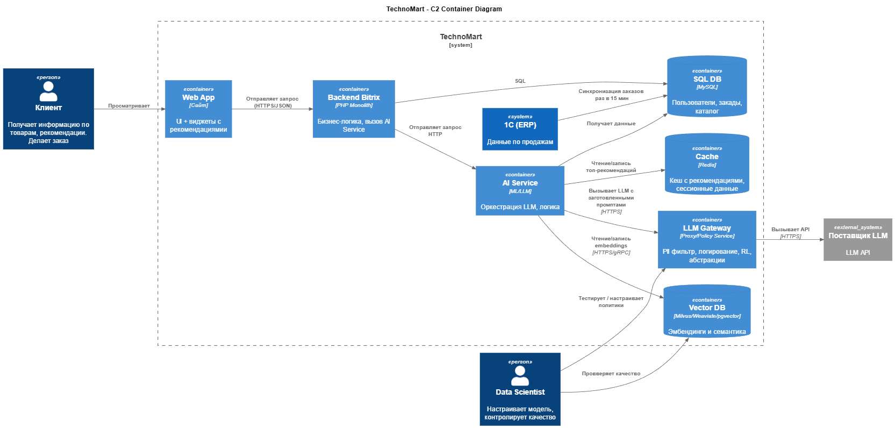
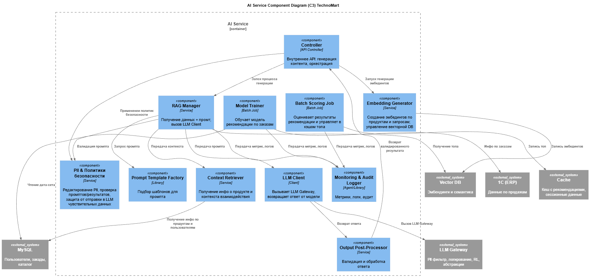
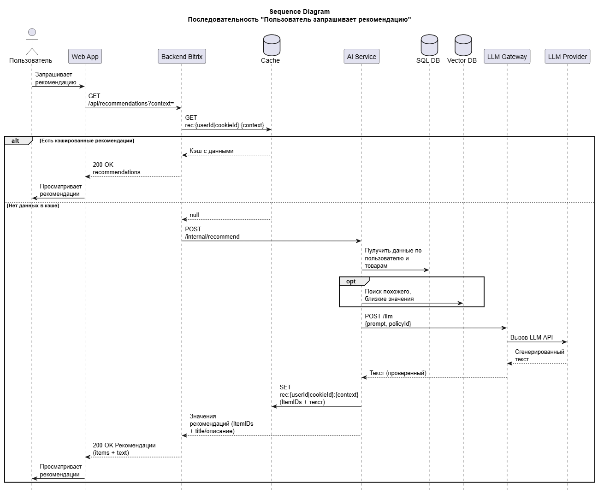

# Домашнее задание №2

## C2 Container Diagram
*Задание:* Нарисуйте диаграмму контейнеров всей системы. Выделите Frontend, Backend, AI Service, Vector DB, SQL DB

*Ответ:*
Ссылка: [C2-ContainerDiagram](./C2-ContainerDiagram.puml)

## C3 Component Diagram
*Задание:* "Провалитесь" внутрь контейнера AI Service. Покажите его внутренние компоненты (например, Controller, RAG Manager, LLM Client, Prompt Template Factory).

*Ответ:*
Ссылка: [C3-ComponentDiagram.puml](./C3-ComponentDiagram.puml)

## Sequence Diagram
*Задание:* Отрисуйте диаграмму последовательности для сценария "Пользователь запрашивает рекомендацию".

*Ответ:*
Ссылка: [sequence](./sequence.puml)

## API Spec
*Задание:* Напишите спецификацию API (в формате YAML/Swagger) для взаимодействия между Backend и AI Service (эндпоинт /get_recommendation).

*Ответ:*
Ссылка на yml файл: [API-Spec](./API-Spec.yaml)
