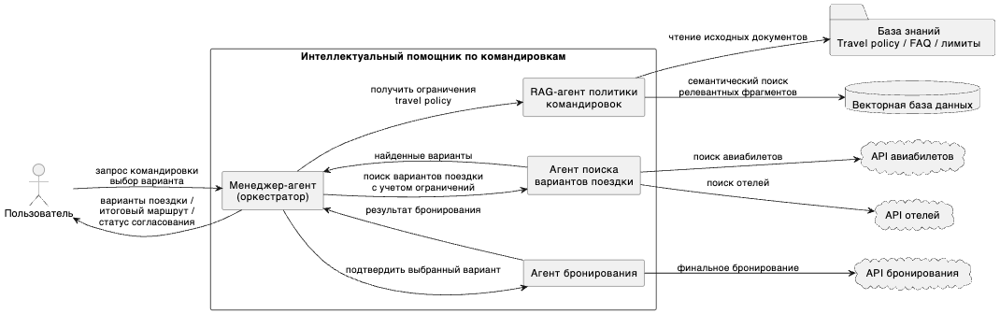
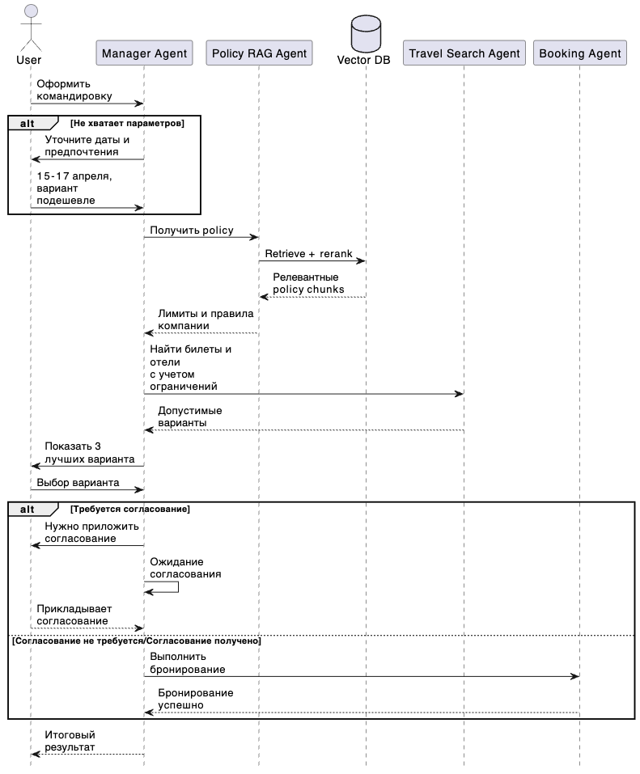

# Домашнее задание №3 

## Задача

**Проектирование интеллектуального ядра:** RAG и мультиагентная система

**Цель:** В этом ДЗ вам нужно спроектировать сложную логику AI-системы, использующую паттерны RAG и агентного взаимодействия.

**Задача:** Спроектировать подсистему "Умный помощник" для оформления командировок.

**Шаги выполнения:**
Выбор паттернов: Определите, какие агенты нужны (например, "Поисковик билетов", "Аналитик бюджета", "Бронировщик отелей").

Архитектура (Design): Нарисуйте схему взаимодействия агентов. Укажите, как используется RAG (откуда берутся данные о политике командировок компании).

RAG Flow: Детально опишите пайплайн RAG: чанкинг, эмбеддинг, реранжинг.

Прототипирование: В Colab напишите упрощенный код (используя LangChain/LangGraph), где один агент ("Менеджер") делегирует задачу другому ("Поисковик") и возвращает ответ.

## Решение

### Выбор способа реализации

Определим основные требования и минимальный набор агентов:
1. **Manager Agent**

Оркестратор.

Функции:
- принимает запрос пользователя;
- задает уточняющие вопросы;
- вызывает остальные агенты;
- собирает shortlist вариантов;
- показывает пользователю варианты;
- после выбора запускает финальное бронирование;
- формирует итоговый ответ.

2. **Policy RAG Agent**

Агент получения корпоративных правил.

Функции:
- извлекает из базы знаний:
лимиты на отель, допустимый класс перелета, правила согласования, требования к документам;
- возвращает структурированные ограничения;

3. **Travel Search Agent**

Один агент вместо двух отдельных.

Функции:

- ищет билеты;
- ищет отели;
- учитывает ограничения от Manager;
- возвращает допустимые варианты.

4. **Booking Agent**

Агент финального оформления.

Функции:
- после выбора пользователя выполняет бронирование;
- создает итоговый маршрут;

### Процесс оформления

1. Пользователь отправляет запрос.
1. Manager Agent проверяет, хватает ли параметров.
1. Если данных не хватает — Manager задает уточняющие вопросы.
1. Manager вызывает Policy RAG Agent.
1. Policy RAG Agent возвращает ограничения компании в структурированном виде.
1. Manager передает ограничения в Travel Search Agent.
1. Travel Search Agent ищет билеты и отели и возвращает допустимые варианты.
1. Manager сам отбирает 2–3 лучших варианта и показывает их пользователю.
1. Пользователь выбирает вариант.
1. Manager проверяет, нужно ли согласование по policy constraints.
1. Если бронирование допустимо, Manager вызывает Booking Agent.
1. Booking Agent выполняет бронирование и возвращает итог.
1. Manager отдает пользователю финальный результат.

### RAG-flow

1. Документы travel policy загружаются в knowledge base;
1. Разбиваются на чанки;
1. Чанки индексируются в vector DB;
1. При запросе Manager вызывает Policy RAG Agent;
1. Policy RAG Agent делает retrieve + rerank;
1. Возвращает структурированные ограничения;
1. Manager использует их дальше в search и booking flow.

### Прототип решения

Собран прототип, для демонстацаии: [Основной файл main.py](./travel-assist-reg/main.py) и [файл для LangGraph](./travel-assist-reg/graph.py)

Сценарий работы прототипа:

1. Формирование вариантов поездки

- анализирует запрос пользователя;
- получает ограничения travel policy через RAG-агента;
- выполняет поиск билетов и отелей;
- формирует shortlist из нескольких вариантов.
В консоли будет выведена таблица вариантов поездки.

2. Выбор варианта

- пользователь вводит номер выбранного варианта;

После выбора система проверяет:
- превышает ли стоимость лимиты travel policy;
- требуется ли согласование.

3. Согласование (если требуется)

Если стоимость превышает лимит, система запросит подтверждение согласования:

4. Бронирование

Если согласование не требуется или было приложено:
- вызывается агент бронирования;
- выполняется финальное бронирование;
пользователю выводится итоговый результат командировки.

5. Выходные данные
В конце выводится:
- выбранные билет и отель;
- общая стоимость поездки;
- статус бронирования;
- идентификатор бронирования

