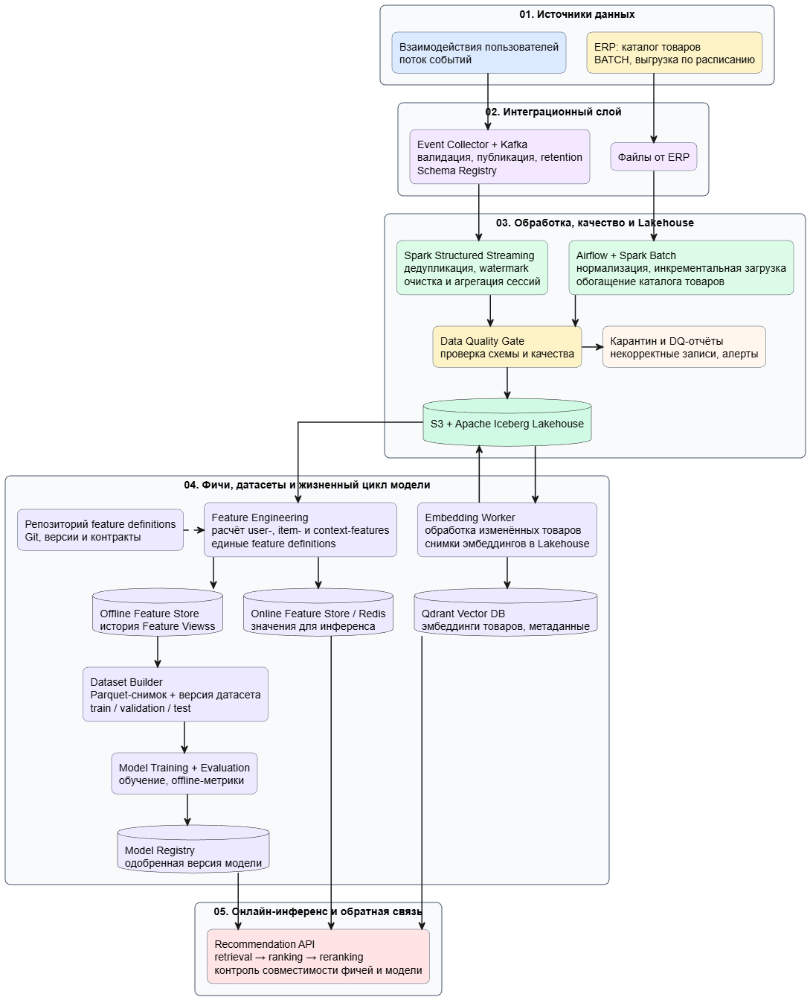

# Домашнее задание 5

**Цель:**
спроектировать data pipeline и выбрать хранилища для обеспечения консистентности данных при обучении и инференсе AI-системы

**Задача:**
Для системы рекомендаций нужно регулярно обновлять данные о товарах и поведении пользователей.

# Data Pipeline для рекомендательной AI-системы

# Общая схема решения

# Ответы на вопросы задания

## 1. Data Sources

В системе используются два типа источников данных.

**Пользовательские взаимодействия** - потоковые события, поступающие из web- и mobile-клиентов. На первом этапе просходит валидация, создание технических идентификаторов и публикация валидных сообщений в Kafka. Kafka обеспечивает буферизацию, хранение событий и их повторное чтение при сбоях или переобработке.

**Каталог товаров из ERP** - пакетная выгрузка по расписанию. Содержит идентификатор товара, название, описание, категорию, цену, наличие и другие атрибуты. Файлы принимаются в интеграционном слое и запускают batch-процесс Airflow + Spark.

## 2. Pipeline Design: ETL/ELT

Потоковые события читаются Spark Structured Streaming. Пакетные данные ERP обрабатываются Spark Batch.

Перед публикацией в Lakehouse оба потока проходят **Data Quality Gate**. Проверяются схема, обязательные ключи, допустимые типы событий, корректность даты, цены и справочников. Записи, не прошедшие правила, направляются в карантин вместе с отчетами и алертами; валидные данные записываются в S3 + Apache Iceberg Lakehouse.

Feature Engineering использует очищенные данные Lakehouse. Рассчитываются user-, item- и context-features: например, число кликов пользователя за час, предпочитаемые категории, популярность товара, цена и наличие. Исторические значения направляются в Offline Feature Store, а последние значения в Online Feature Store/Redis.

Для изменённых товаров Embedding Worker строит эмбеддинги по данным каталога. Снимки эмбеддингов сохраняются в Lakehouse для воспроизводимости, а актуальные векторы с метаданными загружаются в Qdrant Vector DB.

## 3. Выбор компонентов для хранения

| Компонент                         | Назначение и обоснование                                                                                                                   |
| --------------------------------- | ------------------------------------------------------------------------------------------------------------------------------------------ |
| **Kafka + Schema Registry**       | Транспорт и журнал пользовательских событий: буферизация пиков, retention, replay, контроль версий схемы.                        |
| **S3 + Apache Iceberg Lakehouse** | Долговременное хранение данных и витрин. Iceberg обеспечивает ACID-коммиты, эволюцию схем, версионирование и воспроизводимость обучающих датасетов. |
| **Offline Feature Store**         | Исторические Feature Views для подготовки выборок без утечки информации.                                     |
| **Online Feature Store / Redis**  | Последние значения фичей с низкой задержкой, необходимые Recommendation API во время онлайн-инференса.                                     |
| **Qdrant Vector DB**              | Быстрый поиск по эмбеддингам товаров                                               |
| **Model Registry**                | Хранит версии моделей, метрики, статус одобрения и связь модели с версией датасета и фичей.                                                |

## 4. Data Governance и консистентность обучения и инференса

Один из рисков - модель обучается на одних правилах расчета признаков, а онлайн получает признаки, рассчитанные иначе. Для его предотвращения применяются следующие механизмы:

1. Единые feature definitions. Логика и контракты фичей хранятся в Git-репозитории и используются одним Feature контуром для Offline и Online Feature Store. Фичи не реализуются отдельно в коде Recommendation API.
2. Версионирование и lineage. Версионируются схемы событий, Iceberg snapshots, feature definitions, датасеты, эмбеддинги и модели.
3. Для обучения Dataset Builder берёт только значения фичей, доступные на момент события, поэтому в train-выборку не попадает информация из будущего.
4. Контракты совместимости. При развертывании модели проверяется, что Online Feature Store может отдать все фичи с ожидаемыми именами, типами и версиями. Для отсутствующих значений определены fallback-правила.
5. Качество и безопасность. Data Quality Gate блокирует некорректные данные; PII токенизируется или маскируется до аналитических и ML-слоев. Доступ ограничивается RBAC, данные шифруются, а действия с ними аудитируются.

Для последующей оценки качества Recommendation API фиксирует факт показа рекомендации (`recommendation_served`) с `request_id`, `item_id`, позицией и версией модели. Эти данные связываются с кликами и покупками, поступающими через Kafka, и используются для мониторинга и последующего переобучения модели.
